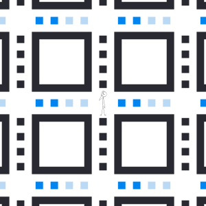

I'm fascinated by systems that can surprise even their own creators. This is the beauty of procedural generation. A few lines of code can spawn near-infinite possibilities, all mathematically bound to the initial rules established by the programmer.

Generative art and procedural generation (or *procgen*) can be as simple or as complex as you want. Generative art is created with the help of an autonomous system, while procedural generation uses algorithms--and often randomness--to produce content. 

The results can be predictable or chaotic. What makes a creation "procedural"? There are two criteria, it usually meets at least one of two criteria: the use of algorithm, and the use of randomness. 

## Random Walks

The random walk, also known as the drunkard's walk, may be the simplest form of procedural randomness. It can be generated in any number of dimensions, but in this post I will demonstrating it within a 2D surface. 

Imagine you find yourself in the middle of a grid of paths. There are sidewalks going east and west, and others going north and south. They are all evenly spaced apart. You are at a crossroads within this grid. You can go in one of four directions. 

In a random walk, you would choose a direction at random to walk, and walk in that direction until the next crossroads. And then you would again choose a direction at random, and walk in *that* direction until you reached the next crossroads -- and so on. Each new step is chosen independently of the previous steps. 

In my own version, I decided to place a pixel on the canvas at 10% opacity. The position of the next pixel (again at 10% opacity) placed was randomly selected from four possibilities -- either directly above, below, left, or right of the one before it. I repeated this process step by step.

What this pattern ends up generating resembles a topographic map. Areas that have been retread multiple times appear darker, while other unexplored areas remain completely white. Over time, more and more of the canvas is filled with color, but the longer it goes, the longer it takes to fill.

<iframe height="500" style="width: 80%;margin-left:10%" scrolling="no" title="Random Walk" src="https://codepen.io/megan-durham/embed/NPGZyXj?default-tab=result" frameborder="no" loading="lazy" allowtransparency="true" allowfullscreen="true">
  See the Pen <a href="https://codepen.io/megan-durham/pen/NPGZyXj">
  Random Walk</a> by Megan Durham (<a href="https://codepen.io/megan-durham">@megan-durham</a>)
  on <a href="https://codepen.io">CodePen</a>.
</iframe>

The pattern can be adjusted in clever ways to generate a variety of effects. By limiting the direction in one dimension -- for example, allowing travel up, down, on forward, but not backward -- you can generate a [lightning effect like this one](https://codepen.io/konstantindenerz/pen/KKOYdpp). And if you connect the last step to the first with a straight line, [you can create geometric shapes resembling buildings](https://codepen.io/DonKarlssonSan/pen/bWWede).[^1]

## Cellular Automata (Conway's Game of Life)

A *cellular automaton* is a visual iterating pattern that uses a grid (of any dimension) consisting of *cells*. A cell has a certain state, such as *on* or *off*, or *alive* or *dead*. With each iteration, each cell's state updates according to the state of its neighbors. 

The most famous cellular automaton is John Conway's "Game of Life". In this pattern, each cell in a 2D grid has an initial state of "alive" or "dead". The cells' states are updated in each iteration according to these rules:

1. An "alive" cell with fewer than two "alive" neighbors (neighbors can border a cell horizontally, vertically, or diagonally) will become "dead" (the "underpopulation" rule).
2. An "alive" cell with 2-3 "alive" neighbors will stay alive.
3. An "alive" cell with more than 3 "alive" neigbhors will become dead (the "overpopulation" rule)
4. A dead cell with exactly 3 "alive" neighbors will become "alive" (the "reproduction" rule).

The initial pattern (or seed) can be set manually or, as I've done below, set randomly.

<iframe height="500" style="width: 80%;margin-left:10%" scrolling="no" title="cellular automata" src="https://codepen.io/megan-durham/embed/myVqapa?default-tab=result" frameborder="no" loading="lazy" allowtransparency="true" allowfullscreen="true">
  See the Pen <a href="https://codepen.io/megan-durham/pen/myVqapa">
  cellular automata</a> by Megan Durham (<a href="https://codepen.io/megan-durham">@megan-durham</a>)
  on <a href="https://codepen.io">CodePen</a>.
</iframe>

To me, the most interesting thing about this pattern isn't the illustrations it produces, but how it creates a timelapse that can tell a story of epic scale. Notice how every now and then you'll have a space of four cells, two on top and two on bottom, that have been stable and alive for several generations, only to be undone by a much larger encroaching pattern venturing from several grid spaces away. 

Eventually, most seeds in the Game of Life will settle in to an infinite holding pattern or loop, but some go on forever. 

The algorithm itself is simple to implement, and there are options to play around with when it comes to visual customization. You can [stack each generation on top of its predecessors to create a 3D structure](https://codepen.io/foretoo/pen/xxeoJoq). You can [play around with color](https://codepen.io/bigsweater/pen/borNym) or go with an [isometric design](https://codepen.io/safx/pen/MWaKqZ).[^2]

## Recursive Backtracker Maze Generation

Now, it's time to put randomness and algorithmic patterns together. There are several generative patterns that make use of both. 

As an example, I made this [spinning hexagon grid](https://codepen.io/megan-durham/full/RNWXbjw) by changing the *range* of the random values determining the speed at which a particular hexagon spins and grows. The closer a hexagon is to the center of the grid, the higher its potential speed. 

The spinning hexagon grid can be described as a "noise-like"[^3] generative pattern. 

Another pattern type that uses "algorithmic randomness" is *maze generation* -- which is exactly what the name suggests. [There are several maze generation algorithms out there](https://en.wikipedia.org/wiki/Maze_generation_algorithm). The one I went with below is the *recursive backtracker* method (or the *randomized depth-first search* method). This method, which implements that random walk pattern shown earlier, creates a grid and tracks the state of each cell as "visited" and "unvisited". 

Here's how it works:

1. Start with a grid of cells, like in our cellular automaton generation. To start, each cell has four walls (north, east, south, and west). All cells are "unvisited".
2. Pick a random starting cell and mark it as "visited". 
3. While there are still "unvisited" cells:
   1. From the current cell, if there are any unvisited neighbors:
      1. Randomly choose an unvisited neighbor.
      2. Remove the wall between the current cell and the neighbor.
      3. Mark the neighbor as the current cell, mark it as visited, and add the previous cell to an array called a "stack" to track the movement.
    2. If the current cell has no unvisited neighbors:
       1. Remove the last cell visited from the stack, and go back to that cell, and repeat the process again. 
    3. If the "stack" is empty, all cells have been visited and the loop can be exited. The process is complete.

And this is the result:

<iframe height="500" style="width: 80%;margin-left:10%" scrolling="no" title="Recursive Backtracker" src="https://codepen.io/megan-durham/embed/pvgpEev?default-tab=result" frameborder="no" loading="lazy" allowtransparency="true" allowfullscreen="true">
  See the Pen <a href="https://codepen.io/megan-durham/pen/pvgpEev">
  Recursive Backtracker</a> by Megan Durham (<a href="https://codepen.io/megan-durham">@megan-durham</a>)
  on <a href="https://codepen.io">CodePen</a>.
</iframe>

Once the maze is complete, you can choose any two points on the grid as your "entrance" and "exit". There will be exactly one path between them. 

As always, there are several adjustments one can make to a maze generation. Instead of using squares as cells, you could use [hexagons](https://codepen.io/timohausmann/pen/YzyXpr). You may try to [creative a visualization of your path](https://codepen.io/obsfx/pen/xMQLmd).[^4] 

## Some other neat patterns

- [Sierpinski Triangle](https://codepen.io/search/pens?q=Sierpinski+Triangle)
- [Tree branching](https://codepen.io/search/pens?q=tree+branching)
- [Mandelbrot set](https://codepen.io/search/pens?q=mandelbrot+set)
- [Golden ratio](https://codepen.io/search/pens?q=golden+ratio) 
- [Kaleidoscope](https://codepen.io/search/pens?q=kaleidoscope)
- [Bauhaus](https://codepen.io/search/pens?q=Bauhaus)

## Recommended Reading

- [On Generative Algorithms](https://inconvergent.net/generative/) *inconvergent (Anders Hoff)*
- [Generative Artistry](https://inconvergent.net/generative/) *Ruth John and Tim Holman*
- [Visualizing Algorithms](https://bost.ocks.org/mike/algorithms/) *Mike Bostock*

## Footnotes

[^1]: [Codepen search results for "Random Walk"](https://codepen.io/DonKarlssonSan/pen/bWWede)

[^2]: [Codepen search results for "Game of Life"](https://codepen.io/search/pens?q=game+of+life)

[^3]: *Noise* refers to random or pseudo-random variations of brightness or color within an image. For a much better explanation and a tutorial, see [this post by Varun Vachhar](https://varun.ca/noise/).

[^4]: [Codepen search results for "Maze Generation"](https://codepen.io/search/pens?q=maze+generation)